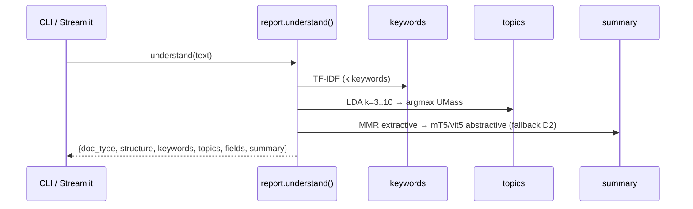

# RCN — Architecture (v2, understanding-first)

Offline document understanding without OCR. `text / .txt / .md / .html / .docx / PDF-text` → layered record (L1 structure → L2 keywords → L3 topics → L4 fields → L5 summary) plus an advisory label. Scanned PDFs/images are classified only.

---

## High-level diagram

```mermaid
flowchart LR
    U[Text / File] --> D[detect]
    D -->|text| P[parsers]
    D -->|image / scan| R[render → classify only]
    P --> L1[L1 structure]
    L1 --> L2[L2 keywords<br/>TF-IDF]
    L2 --> L3[L3 topics<br/>LDA + UMass]
    L3 --> L4[L4 fields<br/>regex]
    L4 --> L5[L5 summary<br/>MMR / mT5 fallback]
    L5 --> REP[understand() seam]
    R -.-> REP
    REP --> JSON[(JSON + Markdown)]
```

---

## Folder layout

```
src/docproc/
  paths.py          # single source of truth for layout + config
  io/               # detect · parsers · render
  preprocess/       # image 64×64/224×224 · text TF-IDF
  models/           # cnn.py (Architecture A) · text_classifier.py (SVM/RF)
  training/         # 2-arm registry · seeded harness
  evaluation/       # metrics + shared report
  nlp/              # structure · keywords · topics · fields · summary · report
configs/            # dataset / text / cnn / pipeline / summary / fields.yaml
scripts/            # understand_text.py · app.py (Streamlit) · train_summarizer.py
models/artifacts/   # text_vectorizer.joblib + text_model_svm.joblib (gitignored)
runs/               # E1 / E0b logs + metrics (gitignored)
datasets/           # raw (700) / text (360) / splits 70/15/15 (0 leak)
```

`docproc.paths` is the only place that knows `ROOT / CONFIG_DIR / RUNS_DIR / DATASETS_DIR`. Every module imports it — no hard-coded paths. Manifest rebuilds are byte-identical.

---

## Request flow



`understand_file(path)` adds one step before this: `detect_file_type` (magic bytes + scanned-PDF probe). Text-like files are parsed then routed through the same flow; images/scanned PDFs return `{doc_type, note: "classification-only"}`.

Artifacts are loaded live. If `text_vectorizer.joblib` is missing the router returns `{"label":"unavailable"}` and the pipeline still completes.

---

## Deployment (local)

```bash
python -m venv .venv && .venv/Scripts/activate
pip install -r requirements.txt
python scripts/understand_text.py --file datasets/text/article/article_0001.md
.venv/Scripts/python -m streamlit run scripts/app.py  # http://localhost:8501
python -m pytest -q  # 186/186
```

| Command | Purpose |
| --- | --- |
| `--demo` | Fixture record without I/O |
| `--folder datasets/text` | Batch + CSV |
| `train_summarizer.py` | Fine-tune vit5 (CPU/GPU/Colab, same file) |

---

## Design notes

- **Understanding-first** — L1/L2/L3 are the products; router is advisory and never fails the pipeline.
- **Deterministic** — same input → same record (LDA seed 42, pure helpers).
- **Course-direct** — TF-IDF, LDA, regex; no LLM, no OCR, offline.
- **Single seam** — `nlp.report.understand()` serves CLI, UI, and tests identically.
