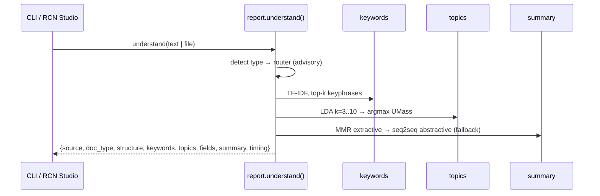

# RCN — Architecture

RCN is an offline document-understanding pipeline for Vietnamese and English. It turns
a text, file, or folder into a layered record — **L1 structure → L2 keywords → L3 topics → L4
fields → L5 summary** — plus an advisory document-type label. This document describes how the
pieces fit together and what is actually trained and shipped.

## At a glance

| Component | Technology | Status |
| --- | --- | --- |
| Document ingestion | PyMuPDF, pypdf, pdfplumber, python-docx, BeautifulSoup4, html2text | shipped |
| Text routing | TF-IDF (uni+bigram) → LinearSVC (GridSearchCV, 5-fold, `f1_macro`) | shipped — `runs/E0b` |
| Image routing | TensorFlow CNN "Architecture A" (64×64) | shipped — `runs/E1` |
| L1 structure | paragraph → sentence → word + stats | shipped |
| L2 keywords | in-document TF-IDF, top-k keyphrases | shipped |
| L3 topics | LDA (sklearn, seed 42) + UMass coherence k-selection; PCA + K-Means topic labels | shipped |
| L4 fields | per-class regex schemas, `configs/fields.yaml` overrides, value normalization | shipped |
| L5 summary | extractive MMR (λ=0.7) · abstractive ViT5/mT5 (<7B) with fallback | shipped |
| 224×224 MobileNetV2 finetune arm | `configs/finetune.yaml`, `finetune_tensor()` | **explored, not shipped** |
| OCR | — | not implemented (scanned pages are rendered and classified, not read) |

## Design principles

- **Understanding-first.** L1–L3 are the product; the router label is advisory metadata and never
  fails the pipeline.
- **Local and text-layer-first.** Text-layer documents are parsed directly; scans/photos are
  currently rendered and classified only. The only model bigger than a vectorizer is a sub-7B
  seq2seq summarizer that runs locally through `transformers`.
- **One seam.** `docproc.nlp.report.understand()` / `understand_file()` serve the CLI, the
  Streamlit app, and the tests identically.
- **Deterministic.** All randomness is seeded (42): same input → same JSON record.
- **Graceful degradation.** Missing artifacts yield `doc_type: "unavailable"` / extractive
  fallback instead of crashes. Every abstractive test self-skips when the checkpoint is absent.
- **Config, not constants.** Hyperparameters live in `configs/*.yaml`; `docproc.paths` is the
  only module that knows the layout.

## Request flow




`understand_file(path)` prepends `io.detect_file_type` (magic bytes + scanned-PDF probe). Text
documents flow through L1–L5; images and scanned PDFs return
`{doc_type, note: "classification-only"}`.

## Document layers

| Layer | Module | What it computes |
| --- | --- | --- |
| L1 structure | `nlp/structure.py` | paragraphs, sentences, words; counts and averages |
| L2 keywords | `nlp/keywords.py` | top-k keyphrases — in-document TF-IDF over uni+bigram, bilingual stopword and number filtering |
| L3 topics | `nlp/topics.py` | LDA topic model; number of topics chosen by UMass coherence (k = 3…10); readable labels from PCA + K-Means on top keyphrases |
| L4 fields | `nlp/fields.py` | structured data per class (invoice number, ISO dates, totals, parties…) via regex schemas; overridable in `configs/fields.yaml`; values normalized |
| L5 summary | `nlp/summary.py` | extractive: sentence scoring with L2 keyphrase priors + MMR anti-redundancy (λ=0.7, config) · abstractive: seq2seq generation with beam search; falls back to extractive on any error |

All five layers are pure functions of their input — no hidden state, no ordering surprises.

## Routing (advisory label)

Six classes: `article`, `form`, `invoice`, `letter`, `receipt`, `report`.

- **Text** → `text_vectorizer.joblib` (TF-IDF) + `text_model_svm.joblib` (LinearSVC, C=0.1 from
  GridSearchCV). Trained by `scripts/run_text_baseline.py`; evaluated in `runs/E0b`.
- **Image** → CNN "Architecture A": Conv2D(32,5) → MaxPool → Conv2D(64,5) → MaxPool → Dense(256)
  → Dropout(0.5) → Softmax(6), 64×64×3 input, sparse cross-entropy, Adam lr=1e-3. Trained by
  `scripts/run_cnn.py`; checkpoint at `runs/E1/best.keras`.

Measured on held-out splits (acceptance gate: ≥ 0.1 margin over the majority baseline *and*
macro-F1 ≥ 0.5):

| Router | Test n | Accuracy | Macro-F1 | Majority baseline | Gate |
| --- | --- | --- | --- | --- | --- |
| Text (SVM) | 54 | **1.00** | **1.00** | 0.17 / 0.05 | pass |
| Image (CNN) | 105 | **0.57** | **0.51** | 0.29 / 0.07 | pass |

Text classes are linearly separable in TF-IDF space (hence 1.00). The image CNN is modest —
representative of what a small CNN learns on 64×64 pages — which is why routing is advisory and
the understanding layers never depend on it.

## Summarization

Two engines behind one `summarize()`:

1. **Extractive (default)** — scores sentences by overlap with L2 keyphrases, applies a small
   bonus to paragraph-initial sentences, then MMR (λ=0.7) removes redundancy. Deterministic.
2. **Abstractive (opt-in)** — a local seq2seq checkpoint generates a fresh summary. The
   checkpoint is chosen in `configs/summary.yaml`:

```yaml
abstractive:
  checkpoint: csebuetnlp/mT5_multilingual_XLSum   # zero-shot multilingual (EN+VI)
  finetuned_checkpoint: vit5_soup_0.5_v1          # self-trained ViT5 family (see below)
  max_new_tokens: 128
  min_new_tokens: 8
  no_repeat_ngram_size: 3
```

`finetuned_checkpoint`, when it names a directory present in `models/artifacts/`, wins over
`checkpoint`; otherwise the code falls back through the available local checkpoints to the base
`checkpoint`. Loading is cached; the tokenizer falls back to `T5TokenizerFast(tokenizer_file=…)`
for artifacts whose `tokenizer.json` predates current `transformers`.

**Self-trained checkpoints** (Vietnamese news summarization, fine-tuned from `VietAI/vit5-base`
in Google-Colab GPU batches; training recipes are archived with the artifacts):

| Artifact | Recipe | Benchmark ROUGE-2 (clean subset) |
| --- | --- | --- |
| `vit5_v1` | ~127k Vietnamese pairs, 2 epochs, full fine-tune | 0.255 |
| `vit5_v2` | low-LR rerun (extractive-leaning) | 0.100 |
| `vit5_soup_0.5_v1` | θ = (1−α)·vit5_v1 + α·vietnews, α = 0.5 | 0.231 |
| `vit5_soup_0.3/0.7_v1/v2` | same recipe, α = 0.3 / 0.7, multiple versions | 0.238–0.289 |
| `vit5_v1_fp16` | half-precision copy of `vit5_v1` (GPU demo) | — |

Other checkpoints kept in `models/artifacts/` (`vit5_base_vietnews_summarization`,
`summarizer_mt5`, `vit5_base_original`, …) serve as comparison points for the benchmark. The
soup experiments at α=0.7 score highest numerically but were exploratory blends without a
recorded recipe; the benchmark recommends `vit5_v1` as the demo checkpoint. Full methodology and
per-doc numbers: [benchmarks/RESULTS.md](benchmarks/RESULTS.md).

## Training data & splits

- **Image corpus** — ~700 page images across the six classes, assembled via
  `scripts/download_rvlcdip_subset.py`; **text corpus** — 360 English business/news documents
  generated with `scripts/make_text_corpus.py` (the understanding layers are language-agnostic
  with bilingual stopwords; Vietnamese coverage comes from the bundled benchmark eval set in
  `benchmarks/data/`).
- Split 70/15/15 (train/val/test) with a manifest (`datasets/splits/manifest.csv`), leak-checked.
- Everything under `datasets/` is gitignored; exact provenance is recorded in
  `datasets/text/PROVENANCE_TEXT.csv`.
- Summarization corpora (XLSum-VI, VietNews, XSum/CNN-DailyMail, …) live outside this
  repository (not versioned).

## Tests & benchmark

```bash
python -m pytest -q            # 177 functional tests — no model artifacts needed (~1 min)
python -m pytest -q -m model   # 12 model-dependent tests (SVM, keras CNN, seq2seq checkpoint)
python benchmarks/run_benchmark.py   # summarize benchmark — eval set is bundled in-repo
```

Test roles and conventions: [tests/system.md](tests/system.md). Benchmark results:
[benchmarks/RESULTS.md](benchmarks/RESULTS.md).

## Honest status

- **Shipped:** full L1–L5 pipeline over text documents; scanned pages and photos classified by
  type; CLI + Streamlit UI; deterministic golden-tested IO; the router models above; a
  fine-tuned Vietnamese abstractive summarizer with recorded recipes.
- **Explored, deliberately not shipped:** the 224×224 MobileNetV2 finetune arm exists only as
  configuration (`configs/finetune.yaml`) and a preprocessing entry point (`finetune_tensor()`);
  low-LR rerun variants (`vit5_v2`) and unreported soup blends are archived as artifacts
  but are not demo defaults.
- **Not implemented yet:** OCR of handwritten/scanned content, cloud APIs, non-deterministic
  LLM pipelines, and multilingual document understanding beyond the two languages the corpus
  covers.
